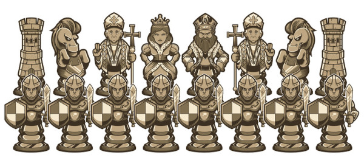

Chess game
==========

L'objectif de ce projet est de concevoir une application permettant à deux joueurs humains de jouer aux échecs.

Les règles
----------

Vous vous baserez sur les règles proposées sur [https://fr.wikipedia.org/wiki/Règles_du_jeu_d'échecs](https://fr.wikipedia.org/wiki/Règles_du_jeu_d'échecs).

Pour les plus intéressés, les règles officielles de la FIDE (Fédération Internationale des Échecs) se trouvent ici : [http://www.echecs.asso.fr/livrearbitre/110.pdf](http://www.echecs.asso.fr/livrearbitre/110.pdf).

Afin d'appréhender le jeu, vous pouvez visiter `lichess.org`, notamment pour :

- [effectuer le tutoriel](https://lichess.org/learn#/)
- [regarder des vidéos sur les règles essentielles](https://lichess.org/video?tags=beginner/fundamentals)

Attendus
--------

#### La jouabilité

Vous devez modéliser et implémenter :

- le **déplacement** tous les types de pièces
- la **capture** des pièces
- la **promotion** des pions en une autre pièce
- la détection des mises en **échecs** et des **"échecs et mat"**

Compterons comme des bonus :

- la possibilité de roquer
- la "prise en passant"
- la détection des pièces clouées
- la détection des pat (parties nulles, plus aucun coup légal n'est possible)

#### L'interface graphique

Votre application doit proposer 3 écrans :

- un écran de **démarrage** pour choisir les paramètres : nom des joueurs, lequel commence avec les blancs, etc.
- un écran de jeu avec **le plateau**, les pièces capturées, les scores, etc.
- un écran de **fin de jeu** qui annonce le vainqueur

Au niveau visuel :

- les **blancs** sont toujours situés en bas du plateau
- les pièces peuvent être symbolisées par une **lettre** sur la case dans un 1er temps, par une image dans un second temps
- la **liste des pièces capturées** par chaque joueur doit être visible en permanence
- lorsque le roi est en **échec**, il faut l'indiquer visuellement, de la façon qui vous arrange : texte, couleur, à côté ou sur le plateau, comme vous préférez)

#### Les interactions

Un joueur doit pouvoir réaliser les actions suivantes :

- Un **premier clic** sur une case avec une pièce à soi doit :
  - **sélectionner** cette pièce,
  - identifier visuellement les **cases de destination** possible de cette pièce.
- Lorsqu'une pièce est sélectionnée, un **second clic** sur une autre case :
  - n'a **aucun effet** si le déplacement est invalide,
  - doit **déplacer la pièce** vers cette case si le déplacement est valide,
  - doit **capturer la pièce adverse** s'il y en a une sur la case de destination.
- Un clic sur une **case vide ou avec une pièce adverse ne doit avoir **aucun effet**.

Attention, **il n'y a pas de gestion du temps, ni de joueur IA**.

Consignes
---------

#### Pour démarrer avec le dépôt Git

- Créez un groupe `nom1-nom2` où nom1 et nom2 sont les noms de famille des deux membres du binôme
- Forkez le dépôt https://git.unistra.fr/a313/a31-chessgame dans le groupe créé ci-dessus
- Ajoutez le responsable du module et votre enseignant de TD/TP comme Reporter de votre dépôt

#### Sur toute la durée

- Ce projet est à réaliser **en binôme**.
- Vous devez concevoir en UML et implémenter en Java le jeu de société Kingdomino, en respectant une **architecture MVC** et en proposant une **interface graphique en Swing**.
- Vous devez respecter les **principes de conception** et mettre en œuvre les **patrons de conception** vus en cours, **lorsque cela est pertinent**. Attention, il ne s'agit pas d'essayer d'utiliser tous les patrons de conception vus en cours !
- Vous rédigerez parallèlement **un (ou des) rapports** pour expliquer vos choix de conception. Il est possible aussi que vous soyez amenés à renoncer à une partie du développement par manque de temps. Dans ce cas, le rapport est l’endroit où signaler ce problème (il aurait fallu faire *ceci* mais je n’avais pas assez de temps devant moi et j’ai préféré me concentrer sur *cela* parce que ...).
- Votre dépôt devra être **mis à jour au minimum après chaque séance de TP** de façon à ce que nous puissions évaluer votre démarche sur toute la durée du projet.

Rendus
------

### 1er rendu

Date limite : le dimanche **11/12 à 23h59**

Documents :

- les diagrammes UML
  - le package `model` doit être décris en anticipant tout le développement
  - les packages `controller` et `view` doivent proposé une version de base mais peuvent être incomplets
- le code source
- un rapport pour expliquer vos choix de conception

Le rendu est à faire sur votre dépôt Git sur une branche nommée `rendu1`.

### 2ème rendu

Date limite : le vendredi **6/01 à 23h59**

Documents :

- les diagrammes UML
	- ils doivent être entièrement cohérent avec le code
	- ils doivent représenter
- le code source
- un exécutable au format JAR
- un mode d'emploi (sur le `README.md`) pour expliquer comment installe et lancer votre application
- un rapport pour présenter vos nouveaux choix de conception depuis le 1er rendu et expliquer les raisons des modifications de choix de conception qui avaient été annoncé au 1er rendu.

Le rendu est à faire sur votre dépôt Git sur une branche nommé `rendu2`.

### Précisions

- Vos diagrammes UML doivent être au format PlantUML et svg,
- Les rapports et le mode d'emploi doivent être au format Markdown.
- À la fin du projet, votre dépôt devra contenir au minimum une branche `rendu1` et une branche `rendu2`, ce seront les seules branches évaluées. Vous êtes libre de gérer le reste de votre dépôt comme vous le souhaitez.
- Pensez à vérifier que votre exécutable fonctionne aussi bien sur Linux, Windows et Mac.
